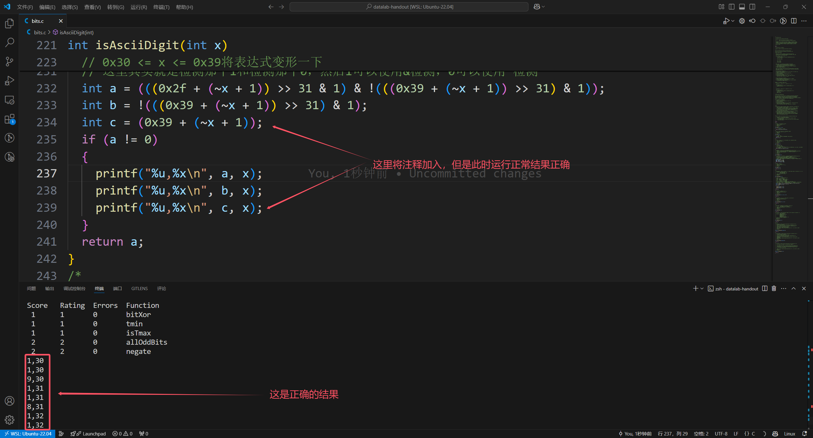

# note for data-lab

```c
/*
 * bitXor - x^y using only ~ and &
 *   Example: bitXor(4, 5) = 1
 *   Legal ops: ~ &
 *   Max ops: 14
 *   Rating: 1
 */
int bitXor(int x, int y) {
    // 使用离散数学表达式转换即可
    return ~((~(x & ~y)) & (~(~x & y)));
}
/*
 * tmin - return minimum two's complement integer
 *   Legal ops: ! ~ & ^ | + << >>
 *   Max ops: 4
 *   Rating: 1
 */
int tmin(void) {
    // 1-->0000...001
    // 将0000... 001左移31位即可获得1000...000也就是tmin
    int x = 1;
    return x << 31;
}
// 2
/*
 * isTmax - returns 1 if x is the maximum, two's complement number,
 *     and 0 otherwise
 *   Legal ops: ! ~ & ^ | +
 *   Max ops: 10
 *   Rating: 1
 */
int isTmax(int x) {
    // tmax=0111...111
    // tmax+1=1000...000
    // 检查第一位为0，其余位为1
    // 左侧括号判断x加一是否为互补状态，这里筛选出来的只有1111...111和0111...111是符合的
    // 右侧括号判断x不是1111...111
    return ((!((x + 1) ^ (~x))) & (!!(~x)));
}
/*
 * allOddBits - return 1 if all odd-numbered bits in word set to 1
 *   where bits are numbered from 0 (least significant) to 31 (most significant)
 *   Examples allOddBits(0xFFFFFFFD) = 0, allOddBits(0xAAAAAAAA) = 1
 *   Legal ops: ! ~ & ^ | + << >>
 *   Max ops: 12
 *   Rating: 2
 */
int allOddBits(int x) {
    // 构造的数字必须在0-255之间，也就是0000 0000 0000 0000 0000 0000 1111 1111
    // 因此通过移位和相加构造出目标1010101010...101010
    // 通过取与运算获得原数字x的全部奇数为为原来的数字，偶数位0
    // 在将这个过滤后仅剩奇数位数字的新数与奇数位全为1的进行取异或运算
    // 如果结果为0则说明x的奇数位全为1，否则只要原来x中的奇数位有一个0就会出现结果为1
    int mask = 0xAA;
    mask = (mask << 8) + 0xAA;
    mask = (mask << 8) + 0xAA;
    mask = (mask << 8) + 0xAA;
    return !((x & mask) ^ mask);
}
/*
 * negate - return -x
 *   Example: negate(1) = -1.
 *   Legal ops: ! ~ & ^ | + << >>
 *   Max ops: 5
 *   Rating: 2
 */
int negate(int x) { return (~x + 1); }
// 3
/*
 * isAsciiDigit - return 1 if 0x30 <= x <= 0x39 (ASCII codes for characters '0'
 * to '9') Example: isAsciiDigit(0x35) = 1. isAsciiDigit(0x3a) = 0.
 *            isAsciiDigit(0x05) = 0.
 *   Legal ops: ! ~ & ^ | + << >>
 *   Max ops: 15
 *   Rating: 3
 */
int isAsciiDigit(int x) {
    // 0x30 <= x <= 0x39将表达式变形一下
    // 0x30 - x <= 0 <= 0x39 - x
    // 0x2f - x就应该是一个负数，也就是1.....
    // 0x39 - x就应该是一个正数，也就是0.....
    // 左侧检测出来是tmin和大于0x2f的数
    // 右侧检测出来的是小于等于0x39的数
    // 但是这里有个坑点，tmin转换之后还是tmin，导致tmin满足第一条
    // 同时第二条使用!导致检测出来的负数也满足非0所以使用!之后导致为真使得陷入了误区
    // 这里其实就是检测那个1和检测那个0，然后1可以使用&检测，0可以使用^检测
    return (((0x2f + (~x + 1)) >> 31 & 1) & (((0x39 + (~x + 1)) >> 31) ^ 1));
}
/*
 * conditional - same as x ? y : z
 *   Example: conditional(2,4,5) = 4
 *   Legal ops: ! ~ & ^ | + << >>
 *   Max ops: 16
 *   Rating: 3
 */
int conditional(int x, int y, int z) {
    // x == 0 >> return z;
    // x != 0 >> return y;
    // 检查这个x是否为0
    // !这是一个好东西，可以将所有的非0数通过!!变成1，然后通过-1也就是(~1 +
    // 1)来实现为0 同时非0的数字可以使用一次!将其变成0，然后通过-1也就是(~1 +
    // 1)来实现为-1也就是全1，此时使用&操作即可获得原来的数因为已经是全1
    return ((!x + (~1 + 1)) & y) + ((!!x + (~1 + 1)) & z);
}
/*
 * isLessOrEqual - if x <= y  then return 1, else return 0
 *   Example: isLessOrEqual(4,5) = 1.
 *   Legal ops: ! ~ & ^ | + << >>
 *   Max ops: 24
 *   Rating: 3
 */
int isLessOrEqual(int x, int y) {
    // 根据之前的0x30-0x39的思路一下子就可以将这个写出来
    // 两者做差取符号位
    // 但是这里需要注意的是如果是<0才是稳定获得1,如果是<=0那就是可能为1也可能为0,所以做好使用非负的符号位为0
    return !((y + (~x + 1)) >> 31 & 1);
}
// 4
/*
 * logicalNeg - implement the ! operator, using all of
 *              the legal operators except !
 *   Examples: logicalNeg(3) = 0, logicalNeg(0) = 1
 *   Legal ops: ~ & ^ | + << >>
 *   Max ops: 12
 *   Rating: 4
 */
int logicalNeg(int x) {
    //
    return ((x | (~x + 1)) >> 31) + 1;
}
/* howManyBits - return the minimum number of bits required to represent x in
 *             two's complement
 *  Examples: howManyBits(12) = 5
 *            howManyBits(298) = 10
 *            howManyBits(-5) = 4
 *            howManyBits(0)  = 1
 *            howManyBits(-1) = 1
 *            howManyBits(0x80000000) = 32
 *  Legal ops: ! ~ & ^ | + << >>
 *  Max ops: 90
 *  Rating: 4
 */
int howManyBits(int x) {
    int sign = x >> 31;
    x = x ^ sign; // 获取一个无符号的x

    int b16 = (!!(x >> 16)) << 4;
    x >>= b16;

    int b8 = (!!(x >> 8)) << 3;
    x >>= b8;

    int b4 = (!!(x >> 4)) << 2;
    x >>= b4;

    int b2 = (!!(x >> 2)) << 1;
    x >>= b2;

    int b1 = (!!(x >> 1)) << 0;
    x >>= b1;

    int b0 = x;

    return b16 + b8 + b4 + b2 + b1 + b0 + 1;
}
// float
/*
 * floatScale2 - Return bit-level equivalent of expression 2*f for
 *   floating point argument f.
 *   Both the argument and result are passed as unsigned int's, but
 *   they are to be interpreted as the bit-level representation of
 *   single-precision floating point values.
 *   When argument is NaN, return argument
 *   Legal ops: Any integer/unsigned operations incl. ||, &&. also if, while
 *   Max ops: 30
 *   Rating: 4
 */
unsigned floatScale2(unsigned uf) {
    unsigned sign = uf & 0x80000000;
    unsigned exp = (uf >> 23) & 0xff;
    unsigned frac = uf & 0x7fffff;

    if (exp == 255) {
        // 如果exp全为1则就是inf直接返回arg
        return uf;
    } else if (exp == 0) {
        // 如果exp全为0则就是denorm，frac左移一位
        frac <<= 1;
    } else {
        // 正常情况就是这样
        exp += 1;
        if (exp == 255) {
            return sign | (exp << 23);
        }
    }
    return sign | (exp << 23) | frac;
}
/*
 * floatFloat2Int - Return bit-level equivalent of expression (int) f
 *   for floating point argument f.
 *   Argument is passed as unsigned int, but
 *   it is to be interpreted as the bit-level representation of a
 *   single-precision floating point value.
 *   Anything out of range (including NaN and infinity) should return
 *   0x80000000u.
 *   Legal ops: Any integer/unsigned operations incl. ||, &&. also if, while
 *   Max ops: 30
 *   Rating: 4
 */
int floatFloat2Int(unsigned uf) {
    unsigned sign = uf & 0x80000000;
    unsigned exp = (uf >> 23) & 0xff;
    unsigned frac = uf & 0x7fffff;

    int E = exp - 127;

    frac |= 0x800000;

    if (E >= 31) {
        // 数字太大了
        return 0x80000000u;
    }
    if (E < 0) {
        // 小数部分
        return 0;
    }

    if (E > 23) {
        // 现在已经默认是23位的整数，如果E大于23，那么就是需要左移来扩大数字
        frac <<= (E - 23);
    } else {
        frac >>= (23 - E);
    }
    if (sign) {
        return -frac;
    } else {
        return frac;
    }
}

/*
 * floatPower2 - Return bit-level equivalent of the expression 2.0^x
 *   (2.0 raised to the power x) for any 32-bit integer x.
 *
 *   The unsigned value that is returned should have the identical bit
 *   representation as the single-precision floating-point number 2.0^x.
 *   If the result is too small to be represented as a denorm, return
 *   0. If too large, return +INF.
 *
 *   Legal ops: Any integer/unsigned operations incl. ||, &&. Also if, while
 *   Max ops: 30
 *   Rating: 4
 */
unsigned floatPower2(int x) {
    int E = x + 127;
    if (E >= 255) {
        return 0x7f800000;
    }
    if (E <= 0) {
        if (E < -149) {
            // 已经是最小的可以表示的次数了
            return 0;
        } else {
            // 这里之所以可以这样是因为已经限定了E<0所以这里的x是小于等于-127的
            return 1 << (x + 149);
        }
    }
    return E << 23;
}
```

## 总结

- 浮点数拆解获取三个区间

  ```c
  unsigned sign = x & 0x80000000;
  unsigned exp = (x>>23) & 0xff;
  unsigned E = exp - 127;
  unsigned frac = x & 0x7fffff;
  ```

- 标准化条件

  ```c
  s = !!s // 获取标准化后的数值，也就是只有两种0x1和0x0
  ```

- 获取区间条件

  ```c
  // a <= x <= b
  // 转换为 x - a >= 0; b - x >= 0;
  // 一般都是选择>=0因为这样比较好保证是符号为0，否则使用<=0时会出现0时符号位为0，负数时符号位为1的不等情况
  int expression1 = ((x - a) >> 31) & 1; //这里&1是为了舍弃算术右移补上来的符号位
  int expression2 = ((b - x) >> 31) & 1; //同上
  // 如果满足在[a,b]区间之内则有exp1和exp2都是0，此时使用!exp1 & !exp2就是bool值为true
  ```

- 切实坑点

  ```c
  // 有时候使用>>是直接获取了移位之后的值，但是有些时候移位之后是需要重新赋值的，记得注意区分
  ```

## 坑点



