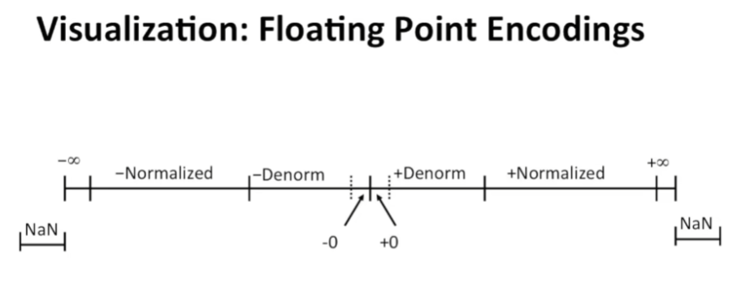
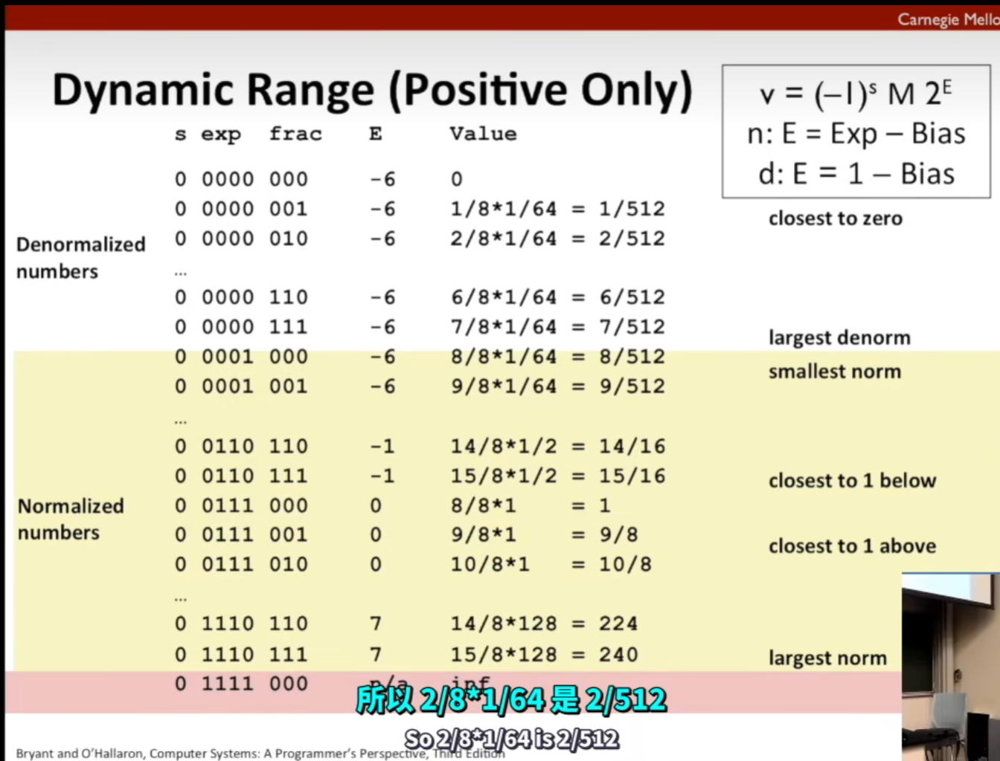
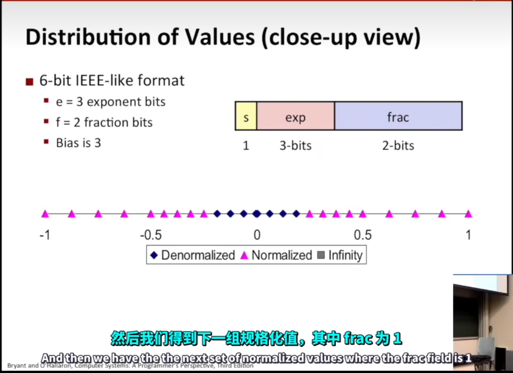
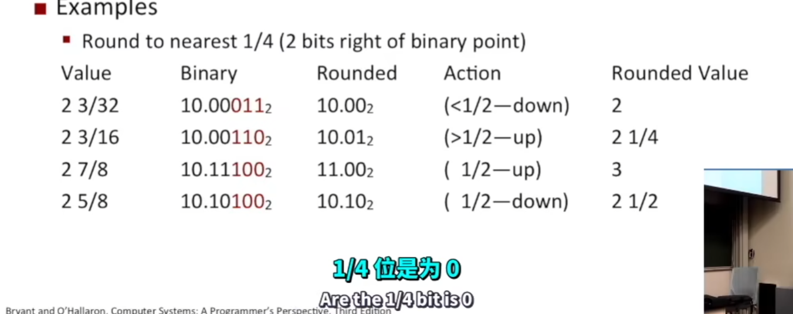
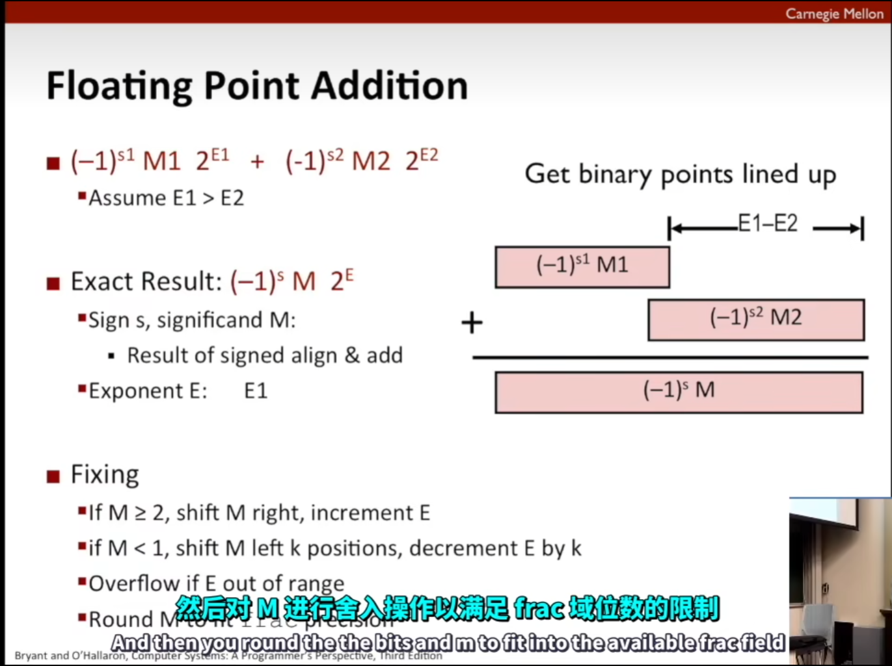

# 浮点数二进制小记

#### Normalized 浮点数的存储

$(-1)^{s}*M*2^E$

$E = Exp - Bias$

浮点数与整数的解读方式是类似，但却是**`不完全相同`**

相信你一定对科学计数法有所耳闻，ojk，就是这样存储的！

符号位/指数位/小数位

```c
1/8/23---32bits
1/11/52---64bits
1/15/63or64---80bits,only for intel
```

`符号位`：0 为正，1 为负

`指数位`：E = Exp - Bias，这里的 Exp 就是在**指数位**直接按照`UINT`读出来的大小，然后$Bias=2^{k-1}-1$这里的$k$就是指数位的位数`bits`

`小数位`：直接按照读就行，指的是小数的部分，然后其实有一个`隐藏的1`！

> 这一部分的储存和前面有点区别
>
> 先看实际例子再解释

```c
float F = 15213.0
```

这里面的的`15213`使用 8 位二进制表示是$15213_{10}=11101101101101_2$

$M = 1.1101101101101_2$

$frac = 111011011011010000000000_2$

> 为什么这里会这样表示呢，其实就是，1 是标准里面默认存在的，然后原来的 15213 使用二进制表示之后，可以表示为二进制里面 1.1101101101101 小数点向右边移动至最右边，不就是和十进制一样的，15213=1.5213\*10000，这两个其实是一样的，一个是二进制里面的小数点移动，一个是十进制的小数点移动
>
> 因此小数位就是 111011011011010000000000

此时知道了小数位，现在就需要表示偏移量了，那偏移量就是将 M 那里的小数点移动到最右侧，与十进制相同，二进制移动小数点也是乘上自己，所以需要移动`13`位

$E = 13$

$E = Exp - Bias$

$s.t. Exp = E + Bias = 13 +127 = 140_{10} = 10001100_2$

> 因此可知指数位就是 10001100

#### Normalized 各参数范围

$0<=Exp<=255$

$-127<=E<=128$

> 为什么会出现这个偏置值，因为根据浮点数的计算公式，最小的时候就是指数部分最小的时候，那么全 0 就可以获得最小的指数部分，此时接近于无限小，那么无限小就是和 0 对应，而无符号数里面的无限小也是全 0，应该只是一个理解方式

#### "Normalized"

规格化情况下`M`会有一个隐含的 1

#### "De-normalized"

非规格情况下`M`直接就是`0.xxxx`

$M = frac$

$E = 1 - Bias$

> 在这种情况下 E 一下就变得很小，可以向 0 过渡，更加丝滑

#### 共存的两种



#### 模拟计算

程序目前在`wsl`，后期将笔记与程序合并

```bash
请输入一个浮点数：5.25
浮点数 5.250000 的二进制表示为：
符号位（Sign bit）：0
指数位（Exponent bits）：10000001
尾数位（Mantissa bits）：01010000000000000000000
```

指数位得出$Exp = 129_{10}$

$E = Exp - Bias = 129_{10} - 127_{10} = 2$

直接就是将尾数部分的小数点右移两位的意思

$frac = 01010000000000000000000_2$

$M = (1 + 0.frac)= 1.01010000000000000000000_2$

$实际结果 = +1 * M * 2^2 = 101.010000000000000000000_2 = 5.25$





> 这个表格可以看出为什么实现了平滑的过渡，这是因为到 Exp=0001 的时候，和 Exp=0000 的时候他们表示的 E 都是一样的，但是 frac 可以减低到 0.xxx 所以使得后面更加接近于 0

#### Rounding

`四舍六入五留双`：这里不一定是具体的数字，也可以是比例

五留双指的是当取整的位数是 5 的时候，需要观察，如果进位可以得到偶数则进位，否则舍去，其实就是前一位为偶数则舍去，前一位为奇数则留下，而且在二进制最后一位是 1 还是 0 即可看出是偶数还是奇数



> 在这个题目里面，后面标红的三个二进制就是需要四舍六入五留双的地方，100 就是他们的一半，然后第一个就是小于 100 所以舍去，第二个大于 100 直接进位，第三个是 100 为一半，但是前面的最后一位是 1，我们需要凑偶数，所以最后一位是 0 才对，因为进位，第四个是 100 为一半，此时前面末尾为 0 即偶数，因此舍去

#### 乘法

`符号位`：`s1 ^ s2`

`M`：`M1 * M2`

`E`：`E1 + E2`

> 但是不会总是很完美，所以超出表示的地方就是会 Rounding

#### 加法



> 通过`E`将高位低位对齐
>
> 保留低位的`E1`，然后原来的高位就是通过移位后再进行运算

#### WARNING

由于四舍六入五留双的性质，会导致大小数字相遇的时候某些数字会跟不存在一样，也就解释了

```python
(3.14 + 1e10) - 1e10 = 0,
3.14 + (1e10 - 1e10) = 3.14
```

导致某些计算会和我们想象的是一样的

> 浮点数的运算不满足结合律,因为会失真

#### 整数和浮点数转换

`double/float -> int`

-   丢弃小数部分,那其实就是 frac 部分通过指数部分移位了小数点之后就可以直接舍去小数点后面的部分,这个是比较简单的
-   向 0 舍入`Rounding toward 0`
-   `inf & NaN sets to Tmin`

> Tmin = 11111111...111->全部都是 1

`int -> double`

-   直接转换,因为`double`足够大装下`int`

`int -> float`

-   看情况四舍六入五留双

> 给出一个小知识，小范围的数字向大范围扩展时不会失真，再次转换回来时也就很正常了，但是大范围的数字向小范围转换的时候导致信息丢失所以再次转换回来就是不行了
