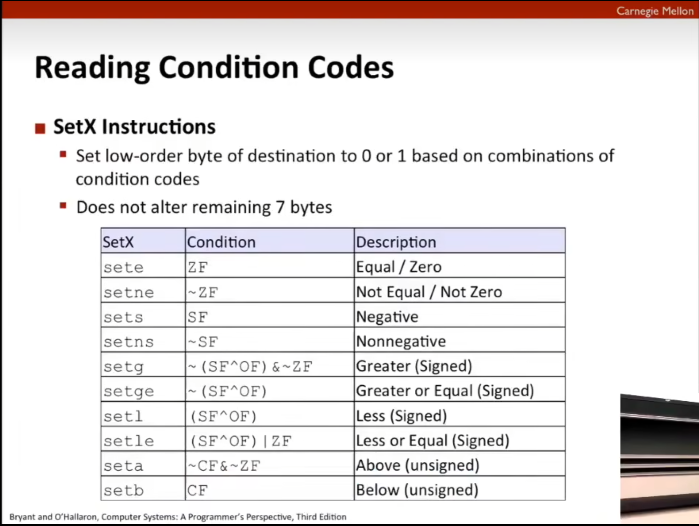
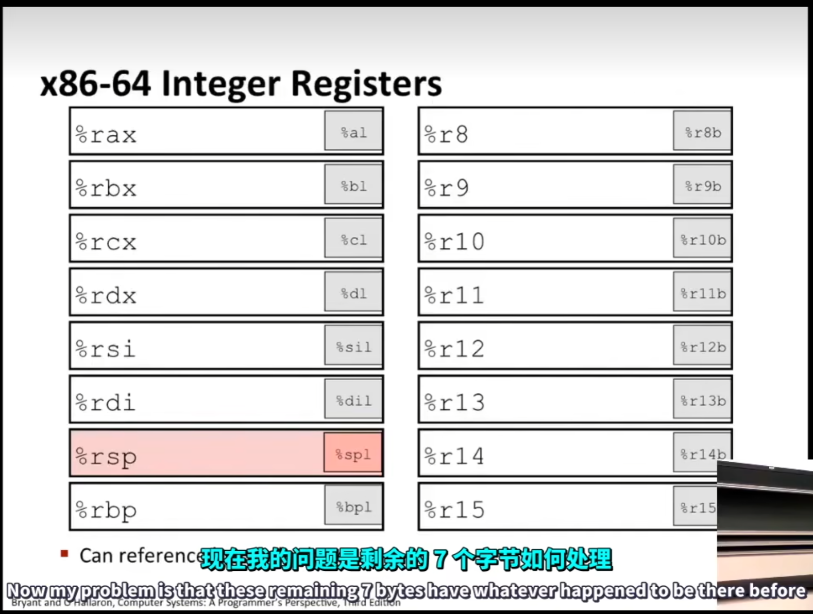
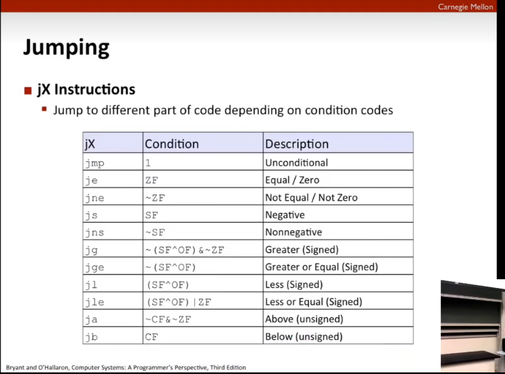

# v6机器级编程-条件

## Condition Codes

```
CF-->carry flow(for unsigned)：进位置1，否则置0
ZF-->zero flow：为0置1，否则置0
SF-->signed flow(for signed)：符号位为1置1，否则置0
OF-->overflow(for signed)：溢出置1，否则置0，注意回顾溢出的条件
```

> 溢出条件：操作后的数字与原操作的两个数字符号位不相同就是溢出

```assembly
# Linux里面的汇编总是后面的为第一个src1
# 同时也会出现src在前，后面为dst
# 这里可以发现是没有dst的，因为只是在ALU的条件寄存器里面进行运算，所以不会出现一般寄存器的赋值
cmpq src2,src1 #cmpq b,a --> b-a
testq src2,src1 #testq b,a --> a&b
```

比较完成之后，就会开始**set一般寄存器**以便可以使用，比较的规则如下



set之后，使用**zero扩展**来将原本只占据了低位的扩展成寄存器的实际大小



## Jumping

跳转是一个很神奇的事情，if-else/switch/loop都离不开跳转

条件code+跳转-->if-else/switch/loop

根据跳转的次数变成循环loop或者是条件语句 



#### 条件实现
```c
// 下面的汇编代码对应此处的C语言代码，可以使用C语言里面的goto来理解更加舒服
if(x<y){
	result = y - x
}else{
	result = x - y
}
```
```assembly
# x in %rdi, y in %rsi
# 此处可能省略了%rax的使用，仅是用于理解，不作语法正确
cmpq %rdi %rsi
jl .l4 #x < y则跳转.l4
sub %rdi,%rsi # result = y - x
.l4 sub %rsi,%rdi # result = x - y
```

#### 循环实现

```c
while(Test){
    Body
}
/*
goto version
if(!test)
	goto done;
loop:{
	Body
	if(test){
		goto loop;
	}
}
*/
```

```assembly
# 根据前面的条件实现就可以知道loop其实就是条件跳转的改版，只是跳转到了执行语句之前，条件跳转是跳转到执行语句之后
```

