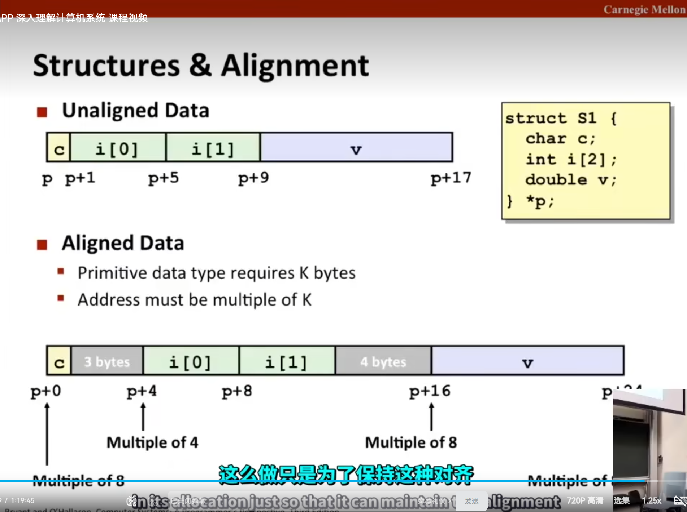

# v8-data

## 数组

#### 数组名称不可变值

```c
int val[4] = {0,1,2,3};
//注意
//val + 1 是合法的，此时指向的是第二个元素的地址
//val ++ 是不合法的，因为这里面将val = val + 1；可是val是不可以改变的
```

#### 数组索引与指针运算

数组的汇编索引就是通过地址的运算来访问对应内存实现的`arr[i][j] == * (arr+(i*C*k)+(j*k))`

```c
//T arr[R][C];
//如果T对应的大小是K字节
//那么arr[i][j] == * (arr+(i*C*k)+(j*k))
//(i*C*k)是行导致的偏移量，(j*k)是列导致的偏移量
//因此在汇编里面是使用后者来实现的，
```

根据上面的就可以写出相应的汇编

```assembly
# int get_arr_ele(int n,int arr[n][n], int i,int j){
#	return arr[i][j];
#}

#上面的C语言对应下面的汇编，并且值得注意的是，C语言在数组传参的时候，传入的是数组的起始地址，也就是arr[0][0]的地址==>&arr[0][0]

# n in %rdi, a in %rsi, i in %rdx, j in %rcx
imulq   %rdx, %rdi        # n*i
leaq    (%rsi,%rdi,4), %rax   # a + 4*n*i
movl    (%rax,%rcx,4), %eax   # a + 4*n*i + 4*j,注意看这里就是对应了上面的运算公式
ret
```

## 结构体

结构体也是通过地址运算来实现的，但是结构体需要记得`对齐`

```c
struct rec{
    char a;
    int b;
};

//可以看出这里的a是1字节，但是b是4字节，因此a随便放，因为是1的倍数即可，如果a放在2字节处，那么b不是从3开始，而是从4字节开始，因为需要和自己的字节大小对齐倍数
```
下面就是一个很明显的`对齐例子`


> 既然有这种特性，因此在声明结构体的时候可以将大字节的数据类型放在前面，然后小字节类型的数据放在后面可以减少一点点内存